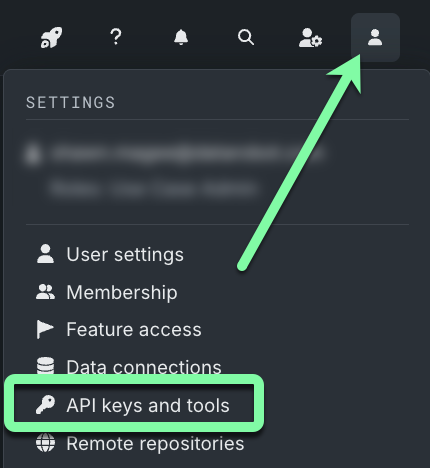
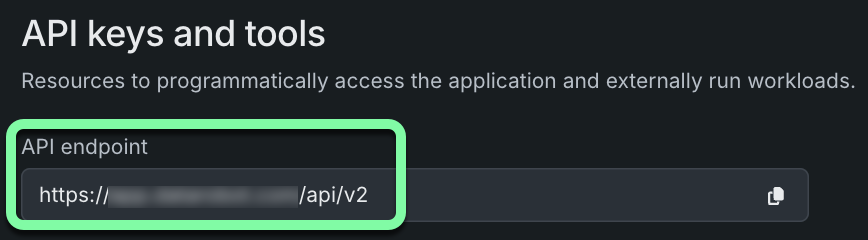
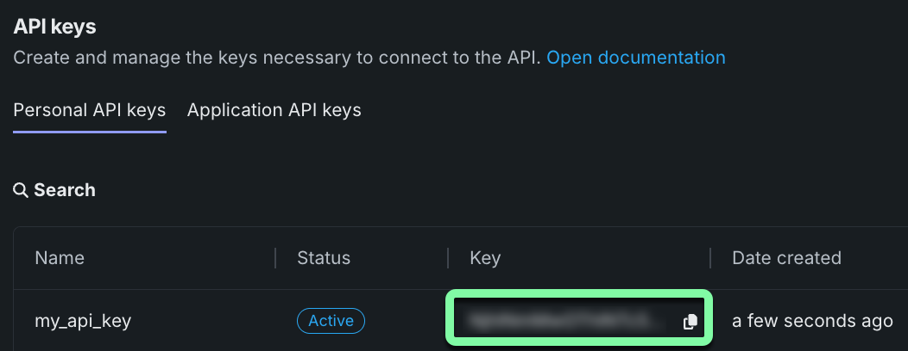

### DataRobot Agent Templates Navigation

- [Home](/README.md)
- [Installing prerequisites](/docs/getting-started-prerequisites.md)
- [Getting started](/docs/getting-started.md)
- [Updating Agentic Templates](/docs/getting-started-updating.md)
- Developing Agents
  - [Developing your agent](/docs/developing-agents.md)
  - [Using the agent CLI](/docs/developing-agents-cli.md)
  - [Adding python requirements](/docs/developing-agents-python-requirements.md)
  - [Configuring LLM providers](/docs/developing-agents-llm-providers.md)
  - [Adding tools to your agent](/docs/developing-agents-tools.md)

---

# Getting started

```diff
-IMPORTANT: Please ensure all prerequisites are installed before proceeding.
```

This guide walks you through setting up a document creation workflow using one of the provided templates.
<!-- what is a document creation workflow? Shouldn't this be "agentic workflow"? -->
The example workflow contains 3 agents:

- **Researcher**: Gathers information on a given topic using web search
- **Writer**: Creates a document based on the research
- **Editor**: Reviews and edits the document for clarity and correctness

The workflow produces a Markdown (`.md`) document about your specified topic.

## Clone the repository

### For cloud users

You can either clone the repository to your local machine using Git or [download it as a ZIP file](https://github.com/datarobot-community/datarobot-agent-templates/archive/refs/heads/main.zip).

```bash
git clone https://github.com/datarobot-community/datarobot-agent-templates.git
cd datarobot-agent-templates
```

### For on-premise users

Clone the release branch for your installation using Git:

```bash
git clone -b release/11.1 https://github.com/datarobot-community/datarobot-agent-templates.git
cd datarobot-agent-templates
```

<!-- Maybe move this to later? -->
> **NOTE:** To customize or track your own workflows, you can 
> [fork this repository](https://docs.github.com/en/pull-requests/collaborating-with-pull-requests/working-with-forks/fork-a-repo), 
> [change the remote URL](https://docs.github.com/en/get-started/git-basics/managing-remote-repositories), or 
> [create a new repository](https://docs.github.com/en/repositories/creating-and-managing-repositories/creating-a-new-repository).

## Locate your DataRobot API key and endpoint

The section after this will require you to add your DataRobot API key and endpoint to your environment variables.
Follow the steps below to locate them.
For full details, see the [DataRobot API keys documentation](https://docs.datarobot.com/en/docs/get-started/acct-mgmt/acct-settings/api-key-mgmt.html).

1. Log in to your DataRobot account.
2. Click the user icon in the top right of the UI and select **API keys and tools**.

  

3. Copy your DataRobot API endpoint and paste it into a temporary file.

  

4. Copy your DataRobot API key and paste it into the temporary file as well.

  

Continue with the next section to configure your environment variables.

## Configure environment variables

Create an `.env` file in the root directory before running any commands:

1. Copy the sample environment file.

  ```bash
  cp .env.sample .env
  ```

1. Edit the file with your preferred text editor.

  ```bash
  nano .env  # or vim .env, code .env, etc.
  ```

1. Insert the DataRobot API key and endpoint that you copied in the previous section into your `.env` file. Leave other variables at their default values during setup.

```bash
# DataRobot API keys and endpoint
DATAROBOT_API_TOKEN=<Your API key>
DATAROBOT_ENDPOINT=<Your API endpoint>
```

## Start and choose an agent framework

Run the helper script to start development:

```bash
task start
```

> **NOTE:** If you encounter errors with `task start` or `task install`, ensure you've completed all 
> [Prerequisites](/docs/getting-started-prerequisites.md) steps.

This repository includes four templates, which are selected during the `task start` process:

| Directory | Framework | Description |
|-----------|-----------|-------------|
| `agent_crewai` | CrewAI | Role-based multi-agent collaboration framework |
| `agent_generic_base` | Generic | Base template for any framework |
| `agent_langgraph` | LangGraph | State-based orchestration framework |
| `agent_llamaindex` | Llama-Index | RAG-focused framework |

Complete the prompts to select your framework. Then finish the initial setup. After selection, only relevant template files remain. **To switch frameworks later, re-clone the repository or copy the desired framework directory from a fresh clone**.

After running `task start`, use `task` from the root directory to see available commands.

> **IMPORTANT:** Run `task install` as prompted during quickstart to install and set up the agent and infrastructure environments.

### Step 4: Test your agent for local development

Test your agent locally using the CLI. Local testing requires DataRobot connection for LLM communication. Ensure your `.env` file has the correct API token and endpoint.

```bash
task agent:cli -- execute --user_prompt 'Tell me about Generative AI'
```

You can now modify agent code and test locally. Continue to the next step to deploy and test in a production-like environment.

### Step 5: Deploy your agent to DataRobot

Deploy your agent to DataRobot:

```bash
task deploy
```

> **NOTE:** If you don't have a pulumi login, use `pulumi login --local` for local login or create a free account at https://app.pulumi.com/signup.

- **First deployment:** Provide a **pulumi stack name** (e.g. `myagent`, `test`, `dev`, `production`) to identify your DataRobot resources
- Review the pulumi preview and approve changes by typing `yes` or pressing `Enter`
- Deployment takes several minutes. When complete, you'll see a resource summary with important IDs/URLs

### Step 6: Test your deployed agent

Test your deployed agent using the CLI with the deployment ID shown after deployment:

```bash
task agent:cli -- execute-deployment --user_prompt 'Tell me about Generative AI' --deployment_id <YOUR_DEPLOYMENT_ID>
```

> **Replace `<YOUR_DEPLOYMENT_ID>`** with your actual deployment ID from the previous step.

**Finding your deployment ID:**
- Terminal output after running `task deploy`
- DataRobot UI → "Console" → "Deployments" → select your deployment → ID shown in URL and "Details" section
- See [DataRobot Deployment documentation](https://docs.datarobot.com/en/docs/mlops/deployment/index.html) for more information

### Step 7: Develop your agent

You're ready to develop your agent! See the [Developing Agents](/docs/developing-agents.md) documentation for next steps:
- [Developing your agent](/docs/developing-agents.md)
- [Using the agent CLI](/docs/developing-agents-cli.md)
- [Adding python requirements](/docs/developing-agents-python-requirements.md)
- [Configuring LLM providers](/docs/developing-agents-llm-providers.md)
- [Adding tools to your agent](/docs/developing-agents-tools.md)
- [Updating your template when new versions are released](/docs/getting-started-updating.md)
