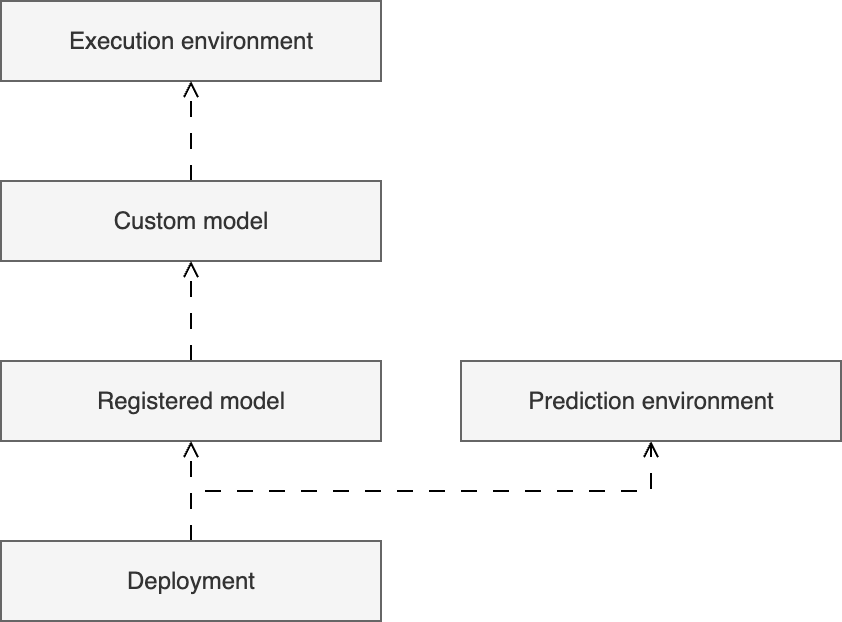

### DataRobot Agent Templates Navigation
- [Home](/README.md)
- [Prerequisites](/docs/getting-started-prerequisites.md)
- [Getting started](/docs/getting-started.md)
- [Updating Agentic Templates](/docs/getting-started-updating.md)
- Developing Agents
  - [Developing your agent](/docs/developing-agents.md)
  - [Using the agent CLI](/docs/developing-agents-cli.md)
  - [Adding python requirements](/docs/developing-agents-python-requirements.md)
  - [Configuring LLM providers](/docs/developing-agents-llm-providers.md)
  - [Adding tools to your agent](/docs/developing-agents-tools.md)
---

# uv

[uv](https://docs.astral.sh/uv/) is a Python **package and project management** solution, combining the features of [poetry](https://python-poetry.org/) and [pipx](https://github.com/pypa/pipx). Written in [Rust](https://www.rust-lang.org/), uv is extremely fast. [Some benchmarks](https://www.digitalocean.com/community/conceptual-articles/uv-python-package-manager) estimate that it is 10x-100x faster than pip or poetry. These benefits make it the best solution for package management in agentic templates.

There are 3 virtual environments used in the templates, each scoped to a folder:

1. Root folder environment used for template management commands.
2. Agent folder environment used to run agent locally.
3. `infra` folder environment used for Pulumi commands.

They are defined in `pyproject.toml` in each folder. You don't need to worry about using the right environment: just run python commands using `uv run` prefix, and `uv` will select the right context for you.

By default, `uv` will use the latest python version available on your machine which satisfies requirements set in `pyproject.toml`. It will download and manage a version, if there is no suitable version installed. You can see all
python versions installed with `uv python list`.

# Task

[Task](https://taskfile.dev/) is a generic build tool, suitable for any project, and inspired by [GNU make](https://www.gnu.org/software/make/manual/make.html). It is cross-platform, allowing for easy installation in MacOS, Linux, or Windows.

Compared to the `Makefile` syntax used by GNU make, the `Taskfile.yaml` syntax used by task is more verbose and readable:

```yaml
version: '3'

vars:
  GREETING: Hello, World!

tasks:
  default:
    cmds:
      - echo "{{.GREETING}}"
    silent: true
```

In DataRobot agentic templates, Task serves as the entry point to **standard operations**, such as installing dependencies, building agents for experimentation, and deploying agents to production.

The primary benefits of Task are:

* **Concise commands**: Because tasks are predefined, instead of typing multiple, verbose commands, you can instead type `task build` or `task deploy` to initiate an automated workflow.

* **Environment management**: Because Task loads environment variables defined in a `.env` file, you don’t need to load these variables manually for every command.

# Pulumi

[Pulumi](https://www.pulumi.com/) is Infrastructure-as-Code (IaC) in Python (or any other programming language). Terraform has a steep learning curve, so Pulumi is implemented to abstract away some of the complexity. To do this, the [pulumi-datarobot](https://pypi.org/project/pulumi-datarobot/) Python package is generated directly from the Terraform provider. This package remains up-to-date with any changes to the API. In addition, the [datarobot-pulumi-utils](https://pypi.org/project/datarobot-pulumi-utils/) Python package provides a set of helper modules to simplify complex operations.

> ℹ️ **Infrastructure-as-Code and Terraform 101**
>
> [Terraform](https://developer.hashicorp.com/terraform) is the industry standard for [Infrastructure-as-Code](https://en.wikipedia.org/wiki/Infrastructure_as_code) (IaC): a way to **define, deploy, and manage** resources for any SaaS product using code. IaC automates the provisioning and updating of these required resources.
>
> The primary use-case for Terraform is provisioning cloud resources, such as EC2 or S3 in AWS; however, it is applicable to most stateful APIs.
>
> IaC is also one of the pillars of [GitOps](https://about.gitlab.com/topics/gitops/): a methodology applying application development processes to the management of cloud resources.
>
> DataRobot has a [terraform provider](https://registry.terraform.io/providers/datarobot-community/datarobot/latest), enabling the creation of [experiments](https://docs.datarobot.com/en/docs/workbench/wb-experiment/index.html), [datasets](https://docs.datarobot.com/en/docs/data/ai-catalog/index.html#ai-catalog), [deployments](https://docs.datarobot.com/en/docs/mlops/deployment/index.html), and other assets.

In agentic templates, Pulumi manages the state of all DataRobot assets associated with your agent: custom models, execution environments, and deployments. At each step, it tracks when changes are needed, and which entities must be updated. As a result, when you update your agent code and use `task build` or `task deploy`, a Pulumi command included in the task generates a plan to update the related remote assets, requests user approval, and then executes the plan.

> 💡 You can also use Pulumi to provide other resources to your use case – for example, credentials, datasets, vector databases, tools, machine learning models, and applications.

Additional reading:

* [How pulumi works](https://www.pulumi.com/docs/iac/concepts/how-pulumi-works/)
* [Stacks](https://www.pulumi.com/docs/iac/concepts/stacks/)

> ⚠️ Changes made to an agentic workflow in the DataRobot UI (via codespace or workshop) cannot be synced with changes made locally and managed by Pulumi. Be careful when modifying agentic workflow code in both locations. If you experiment and change agent code in the DataRobot UI, ensure you port it back to your local codebase.

# Task commands

## start

Prepares agentic workflow templates for use and local development.


## setup

Installs the Python environment dependencies required to run the agentic workflow.


## build

Creates or updates the resources required in DataRobot to begin or continue experimentation with an agentic workflow:

1. Use Case
2. Custom execution environment (if a pre-built environment isn’t defined)
3. Custom model


The base process is the same for `task build` and `task deploy`. The difference is within the Pulumi program’s logic. `task build` does not include the steps necessary to prepare your agent for production usage, making it much faster to execute.

The chart below illustrates what happens in the Pulumi program:


## deploy

Initially follows the same process as `task build`, but proceeds to the steps to prepare an agent for production usage, such as creating a Deployment with. Launching a deployment takes time, so ensure that you properly test the agentic workflow before running this command.


> ℹ️ Pulumi tracks dependencies between entities; therefore, if you change an entity upstream, the entities downstream are updated or recreated. This means that if you change a custom model in DataRobot, you must create a new registered model and a new deployment from that registered model. Below is a diagram of these dependencies:
> 
